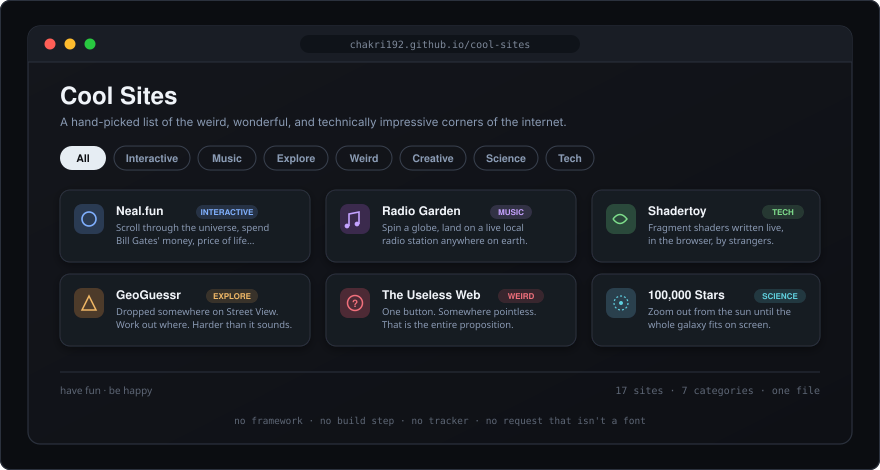

<div align="center">

# Cool Sites

**A hand-picked list of the internet's weirder corners.**

One HTML file. No framework, no build step, no tracker, and no network request that isn't a font.

<p>
  
  
  
  
  
</p>

<br />



**[chakri192.github.io/cool-sites](https://chakri192.github.io/cool-sites/)**

</div>

<br />

---

## What's on it

Seventeen sites, filterable by category. Nothing here is a link farm — each one is somewhere worth ten minutes.

| Category | Sites |
|---|---|
| **Interactive** | Neal.fun · Quick Draw! · Akinator |
| **Music** | Radio Garden · Patatap |
| **Explore** | GeoGuessr · 100,000 Stars |
| **Weird** | The Useless Web · Scream Into the Void |
| **Creative** | This Is Sand |
| **Science** | This Person Does Not Exist · Loopy |
| **Tech** | WebGL Fluid Simulation · The Evolution of Trust · Parable of the Polygons · Google Experiments · Shadertoy |

Clicking a category filters the grid with an animated re-entry, and hovering a card expands its truncated description.

---

## How it's built

Plain HTML, CSS, and a small amount of vanilla JavaScript, all in one file. The only external request is the Google Fonts stylesheet — Plus Jakarta Sans for headings, Nunito for body text.

Every site icon is a hand-drawn inline SVG rather than an emoji or an icon font. That's more work up front and it's why the page has no icon dependency, renders identically everywhere, and stays sharp at any zoom level.

Filtering is a class toggle on `data-cat` attributes. There is no state management here because there is no state — the category buttons set one attribute and CSS does the rest.

---

## Running it

There is nothing to install and nothing to build.

```bash
git clone https://github.com/chakri192/cool-sites.git
cd cool-sites && open index.html
```

That's it — the file works straight off the filesystem.

### Publishing your own

**GitHub Pages** — fork it, then **Settings → Pages**, source `main` / `root`. Live at `https://<you>.github.io/cool-sites`.

**Netlify** — drag `index.html` onto [netlify.com](https://netlify.com) → *Add new site → Deploy manually*.

Any static host works. It's one file.

---

## Adding a site

Copy any `.site-item` block and change six things: the `href`, the name, the description, the display URL, `data-cat`, and the badge class. Then swap the inline SVG for one of your own.

A new category needs three additions: a `.badge-X` style, a filter `<button>`, and `data-cat="X"` on the items that belong to it.

---

## Layout

```
cool-sites/
├── index.html       the page — markup, styles, script, and every icon
├── cool-sites.html  an older copy of index.html, kept by accident
└── docs/            the preview in this README
```

`cool-sites.html` is a near-identical duplicate of `index.html` — they differ by a single character in the footer. `index.html` is the one GitHub Pages serves and the one to edit; the other can be deleted.

---

## License

MIT for the page itself. The linked sites belong to their own authors.
